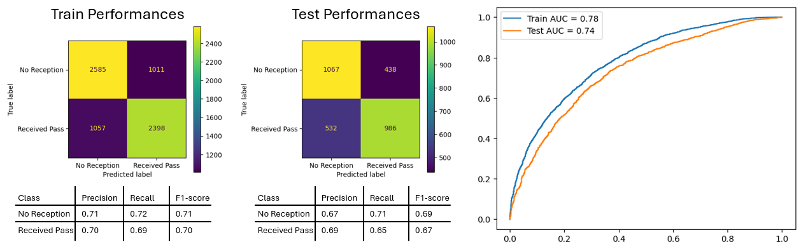

# PreSnapPrediction

## Reception Zones and the ORPSP Metric
### Introduction
NFL pass playbooks are built around precise receiver routes and strategically chosen reception zones to exploit defensive gaps. Route combinations are designed to create space and exploit defensive weaknesses by coordinating multiple receivers' movements. Concepts like flooding a zone attack different depths in one area, while rub routes disrupt man-to-man coverage. Combinations such as post and corner stretch defenses vertically, while stick and flat create horizontal separation. These designs ensure at least one receiver is likely to be open, providing clear options for the quarterback.

For each play design, understanding how likely each receiver is to be open is key to execution. Factors like route depth, timing, and combinations dictate which receiver has the best chance of being in a favorable position. By recognizing these probabilities before the snap, quarterbacks can prioritize high-percentage options and deliver the ball with confidence and precision.

### Reception Zone Identification for Every Route
Each route is designed to guide the receiver into a specific area on the field where they could be targeted by the quarterback. Identifying these reception zones is essential for understanding the likelihood of a receiver being open.

In the tracking data, it is straightforward to identify the reception zones of receiver routes that are targeted. However, the goal is to determine them for all routes run. The strategy of determining reception zones for groups of routes is an efficient method to identify the reception zones for all routes, leveraging the targeted routes within each group. There are numerous variations of distinctly different routes within the same "routeRan" categories, and these routes do not always appear to be consistently classified. Therefore, performing clustering is necessary to create more precise route groups.

Routes from the same categorie can go in different directions depending on whether the receiver is on the left or right side of the football. For example, an out route on the left side goes in the opposite direction of an out route on the right side but in the same direction as an in route. While the two out routes may be identical, they would not be grouped together without preprocessing. To address this, it is simpler to consider out and in routes as 90-degrees angle routes and standardize them to go in the same direction. Consequently, all routes are standardized.

    
    Figure 1. Route standardization

With all routes standardized to the same direction, clustering can be applied using key features such as the coefficients of a quadratic approximation, positions at specific frames and their standard deviation over time. Affinity Propagation is a robust choice that delivers accurate clustering results. The algorithm autonomously identifies cluster centers and assigns data points to clusters by evaluating both the similarity between data points and their suitability as exemplars. Reception zones can be assigned to the resulting clusters based on the targeted routes within each cluster.

    
    Figure 2. Route clustering and identified reception zones

The average route time are calculated from the targeted routes for each cluster, providing more valuable information.

For each route run, a reception zone and its route time are determined by identifying its corresponding cluster. Below is an example play showcasing the computed reception zones and route times.

    
    Figure 3. Example play with reception zones

### Introducing the ORPSP Metric: Open Receiver Pre Snap Probability
Now that quarterbacks have information on where and when their receivers can be targeted for every route, it becomes relevant to analyze the probability of receivers being open in their respective reception zones. This paper focuses on an open receiver pre-snap probability independent of the defense, based solely on data that could be found in a pass playbook and additional general information about the play.

To model this probability, all receiver routes that were targeted or where the quarterback was sacked or scrambled are used. Receiver routes resulting in a completed pass are labeled as successful, while all the others are labeled as unsuccessful. For each receiver route, the computed features include its characteristics, such as the route type, route time, positioning of the receiver at lineset and of its reception zone. Additional play features include the offensive formation, receiver alignment, route and reception zone combinations... The classification model used is a gradient boosting algorithm, where the predicted probability of success for each route run represents the new metric, ORPSP.

    
    Figure 4. ORPSP classification model performances

The model performances are not great but they are still significant enough to provide valuable insights. The study of Shapley values reveals the key characteristics that contribute to the success of a route. The route time feature emerges as the most relevant one. **The quicker the route, the more likely the receiver will be open in its reception zone**. Thus the model detects that quick plays where the quarterback throws the football to receivers with short routes have a higher chance of success. An other feature worth mentioning is the distance between the receiver at lineset and the back of the endzone. **The closer to scoring a touchdown, the less likely the receiver will be open in its reception zone**. Other model interpretations include examples such as:
- The higher the down number, the less likely the receiver will be open
- The more reception zones before the line of scrimmage on the play, the less likely the receiver will be open
- The more straight routes on the play (such as a Hail Mary), the less likely the receiver will be open
- The closer the reception zone is out of bounds, the less likely the receiver will be open

The ORPSP metric is computed to all receiver routes from the previous example.

    
    Figure 5. Example play with the ORPSP metric

In the above example, the quarterback targets the receiver with the highest ORPSP score. The receiver ends up catching the ball for a gain of more than 10 yards. In the example bellow, the quarterback focuses on his right side while the receiver with the highest ORPSP score in on his left. This receiver is indeed open as the quarterback ends up beeing sacked.

    
    Figure 6. Second example play with the ORPSP metric

### Metric Analysis and Use Cases

### Conclusion
