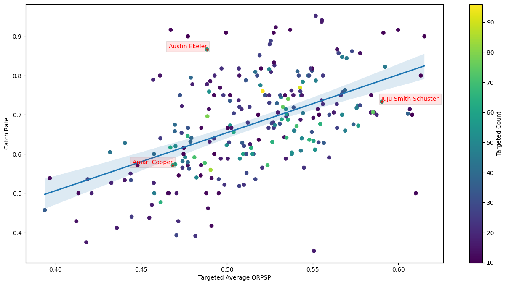

# PreSnapPrediction

## Reception Zones and the ORPSP Metric
### Introduction
NFL pass playbooks are built around precise receiver routes and strategically chosen reception zones to exploit defensive gaps. Route combinations are designed to create space and exploit defensive weaknesses by coordinating multiple receivers' movements. Concepts like flooding a zone exploit different depths in one area, while rub routes disrupt man-to-man coverage. Combinations such as post and corner stretch defenses vertically, while stick and flat create horizontal separation. These designs ensure at least one receiver is likely to be open, providing clear options for the quarterback.

For each play design, understanding how likely each receiver is to be open is key to execution. Factors like route depth, timing, and combinations dictate which receiver has the best chance of being in a favorable position. By recognizing these probabilities before the snap, quarterbacks can prioritize high-percentage options and deliver the ball with confidence and precision.

### Reception Zone Identification for Every Route
Each route is designed to guide the receiver into a specific area on the field where they could be targeted by the quarterback. Identifying these reception zones is essential for understanding the likelihood of a receiver being open.

In the tracking data, it is straightforward to identify the reception zones of receiver routes that are targeted. However, the goal is to determine them for all routes run. The strategy of determining reception zones for groups of routes is an efficient method to identify the reception zones for all routes, leveraging the targeted routes within each group. There are numerous variations of distinctly different routes within the same "routeRan" categories, and these routes do not always appear to be consistently classified. Therefore, performing clustering is necessary to create more precise route groups.

Routes from the same category can go in different directions depending on whether the receiver is on the left or right side of the field. For example, an out route on the left side goes in the opposite direction of an out route on the right side but in the same direction as an in route. While the two out routes may be identical, they would not be grouped together without preprocessing. To address this, it is simpler to consider out and in routes as 90-degrees angle routes and standardize them to go in the same direction. Consequently, all routes are standardized.

    
    Figure 1. Route standardization

With all routes standardized to the same direction, clustering can be applied using key features such as the coefficients of a quadratic approximation, positions at specific frames and their standard deviation over time. Affinity Propagation is a robust choice that delivers accurate clustering results. The algorithm autonomously identifies cluster centers and assigns data points to clusters by evaluating both the similarity between data points and their suitability as exemplars. Reception zones can be assigned to the resulting clusters based on the targeted routes within each cluster.

    
    Figure 2. Route clustering and identified reception zones

The average route time are calculated from the targeted routes for each cluster, providing more valuable information.

For each route run, a reception zone and its route time are determined by identifying its corresponding cluster. Below is an example play showcasing the computed reception zones and route times.

    
    Figure 3. Example play with reception zones

### Introducing the ORPSP Metric: Open Receiver Pre Snap Probability
Now that quarterbacks have information on where and when their receivers can be targeted for every route, it becomes relevant to analyze the probability of receivers being open in their respective reception zones. This paper focuses on an open receiver pre-snap probability independent of the defense, based solely on data that could be found in a pass playbook and additional general information about the play.

To model this probability, all receiver routes that were targeted and all receiver routes where the quarterback was sacked or scrambled are used. Receiver routes resulting in a completed pass are labeled as successful, while all the others are labeled as unsuccessful. For each receiver route, the computed features include its characteristics, such as the route type, route time, positioning of the receiver at lineset and of its reception zone. Additional play features include the offensive formation, receiver alignment, route and reception zone combinations... The classification model used is a gradient boosting algorithm, where the predicted probability of success for each route run represents the new metric, ORPSP.

    
    Figure 4. ORPSP classification model performances

The model performances are not great but they are still significant enough to provide valuable insights. The study of Shapley values reveals the key characteristics that contribute to the success of a route. The route time feature emerges as the most relevant one. **The quicker the route, the more likely the receiver will be open in its reception zone**. Thus, the model identifies that quick plays where the quarterback throws the football early to receivers running quick routes have a higher chance of success. An other feature worth mentioning is the distance between the receiver at lineset and the back of the endzone. **The closer to scoring a touchdown, the less likely the receiver will be open in its reception zone**. Other model interpretations include examples such as:
- The higher the down number, the less likely the receiver will be open
- The more reception zones before the line of scrimmage on the play, the less likely the receiver will be open
- The more straight routes on the play (such as a Hail Mary), the less likely the receiver will be open
- The closer the reception zone is out of bounds, the less likely the receiver will be open

The ORPSP metric is computed to all receiver routes from the previous example.

    
    Figure 5. Example play with the ORPSP metric

In the above example, the quarterback targets the receiver with the highest ORPSP score. The receiver ends up catching the ball for a gain of more than 10 yards. In the example bellow, the quarterback focuses on his right side while the receiver with the highest ORPSP score in on his left.[[1]](#1) This receiver is indeed open as the quarterback ends up beeing sacked.

    
    Figure 6. Second example play with the ORPSP metric

### ORPSP Metric Analysis
With the ORPSP metric computed for all routes run by the receivers, it is possible to provide context when evaluating the receivers' performance over the weeks. The receivers' catch rates are compared with their calculated average ORPSP for every targeted route. This puts receptions into perspective based on the difficulty level of the receivers getting open.

    
    Figure 7. Receivers performance: catch rate VS targeted average ORPSP

There is a strong correlation between catch rate and targeted average ORPSP, with a Pearson coefficient of 0.52. This confirms that the lower the receiver's average probability of getting open, the lower their catch rate will be.

Comparing the two wide receivers, JuJu Smith-Schuster and Amari Cooper, based solely on their catch rate would favor JuJu Smith-Schuster. His catch rate is 0.73, significantly higher than Amari Cooper's 0.57. However, taking the targeted average ORPSP into account reveals an explanation for this difference. Both receivers are performing as expected based on the likelihood of getting open. Amari Cooper runs routes that are less likely to allow him to get open, which leads to a lower catch rate. He ended up ranked 15th in the PFF 2022 wide receiver regular season rankings, which noted: "Cooper’s performance flew under the radar in 2022".[[2]](#2)

One player performing above expectations is Austin Ekeler. His catch rate is significantly higher than the average receiver with a same targeted average ORPSP. He went on to record the most catches by a running back in a single season in Chargers history.[[3]](#3)

It is also possible to contextualize quarterbacks' performances by comparing their completion rate to the average ORPSP of the receivers they target. The targeted receiver average ORPSP value indicates whether a quarterback tends to take more or fewer risks.

    
    Figure 8. Quarterbacks performance: Completion rate VS targeted receiver average ORPSP

The correlation between completion rate and targeted receiver average ORPSP is significant, with a Pearson coefficient of 0.42. A quarterback that takes fewer risks is more likely to have a high completion rate.

Geno Smith leads all quarterbacks in completion rate at 0.74. Based on his targeted receiver average ORPSP, he is performing well above expectations while taking intermediate risks. By the end of the season, he set several Seahawks franchise records, including the highest single-season completion percentage and the most pass completions in a single season. Geno Smith was named Comeback Player of the Year by the Associated Press and the Pro Football Writers of America (PFWA).[[4]](#4)[[5]](#5) In addition, the PFWA named him as their Most Improved Player.[[6]](#6)

Matt Ryan also records an impressive completion rate of 0.72, ranking third among quarterbacks with more than 50 throws. However, he is the quarterback taking the fewest risks and has the highest targeted receiver average ORPSP. His completion rate aligns with what is expected from him based on the risks he takes. Matt Ryan was benched during the season, which would turn out to be his last before retiring.[[7]](#7)[[8]](#8)[[9]](#9)

### Designing a Pass Playbook
For each play design, it is now possible to determine how likely each receiver is to be open, along with the location and timing. It then becomes feasible to create a pass playbook with this key information, guiding the quarterback's decisions during the game. Below is a prototype of a dashboard designed to help coaches in creating pass plays.

    
    Figure 9. NFL Plays Designer dashboard

After selecting a formation and a receiver alignment, coaches can adjust the positions of the receivers and their reception zones while choosing their route types. They can also edit the context of the play by modifying the absolute yard line, the yards to go, and the down number. Computing the designed play provides predictions for each receiver's route time and ORPSP value.

Coaches have the ability to fully create a pass playbook with critical information to assist in decision-making. Together with the quarterbacks, coaches can study the critical zones that need to be prioritized at different moments of a play.

### Conclusion
The integration of reception zones and the ORPSP metric provides invaluable insights into both decision-making and performance. By identifying where and when a receiver is likely to be open, coaches and quarterbacks can make more informed decisions during play design and execution.

The analysis of the ORPSP model allows for a deeper understanding of how route time, red zone, and route combinations influence a pass's success.

The ability to contextualize performance data with route difficulty and risk-taking helps identify overperforming players, such as receiver Austin Ekeler and quarterback Geno Smith.

Ultimately, this methodology empowers coaches to design more effective playbooks, prioritize high ORPSP, and tailor strategies that enhance the likelihood of success on the field.

### References
<a id="1">[1]</a> [First sack of 2022! Von Miller takes down Matt Stafford | Bills at Rams](https://www.buffalobills.com/video/first-sack-of-2022-von-miller-takes-down-matt-stafford-bills-at-rams). Buffalo Bills.

<a id="2">[2]</a> Zoltán Buday (Feb 28, 2023). [Ranking the 25 best wide receivers from the 2022 NFL regular season](https://www.pff.com/news/nfl-final-2022-wide-receiver-rankings). Pro Football Focus.

<a id="3">[3]</a> [Ekeler Surpasses L.T. for Most Catches by Bolts RB in Single Season on Shifty 17-Yard Catch](https://www.chargers.com/video/ekeler-surpasses-lt-most-catches-single-season-2022). Chargers.

<a id="4">[4]</a> [AP Comeback Player of the Year Winners](https://www.pro-football-reference.com/awards/ap-comeback-player-award.htm). Pro Football Reference.

<a id="5">[5]</a> [PFWA Comeback Player of the Year Winners](https://www.pro-football-reference.com/awards/pfwa-comeback-player-award.htm). Pro Football Reference.

<a id="6">[6]</a> [PFWA Most Improved Player Winners](https://www.pro-football-reference.com/awards/pfwa-most-improved-player-award.htm). Pro Football Reference.

<a id="7">[7]</a> Nick Shook (Dec 21, 2022). [Colts bench Matt Ryan, name Nick Foles starting QB for Monday's game vs. Chargers](https://www.nfl.com/news/colts-bench-matt-ryan-name-nick-foles-starting-qb-chargers-monday-night). NFL.

<a id="8">[8]</a> JJ Stankevitz (Mar 15, 2023). [Colts release QB Matt Ryan](https://www.colts.com/news/matt-ryan-released-quarterback-2023-nfl-free-agency-falcons). Colts.

<a id="9">[9]</a> Terrin Waack (Apr 22, 2024). [Matt Ryan announces retirement, signs one-day contract with Atlanta to retire a Falcon](https://www.atlantafalcons.com/news/matt-ryan-retirement-one-day-contract-quarterback). Atlanta Falcons.
